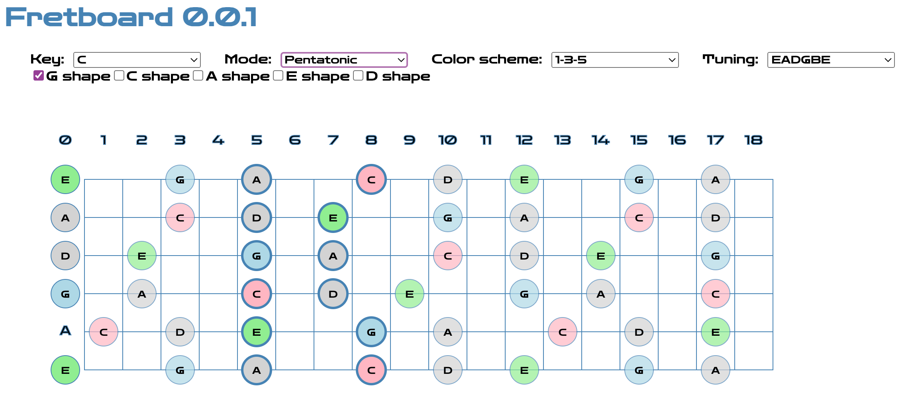

# Fretboard : learn the guitar fretboard

Fretboard is a lighweight application to learn the guitar or banjo fretboard.



# Changelog

### Version 0.0.1
_2023/11/19_

First version

# Developer workflow
Fretboard is a pure JS/HTML app and does not require any build process.

To run locally, simply start a web server. For example using Python
```
python -m http.server
```
